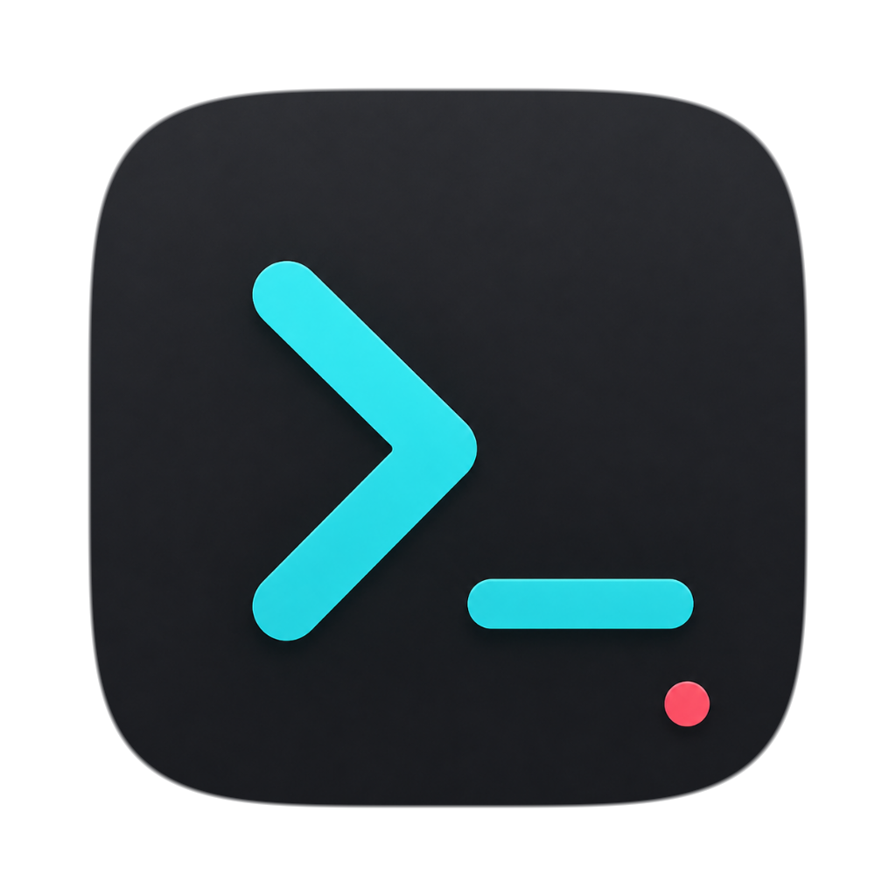

<p align="center">
  
</p>

# Cockpit

Cockpit is a local flight deck for Claude Code and Codex CLI sessions.

I still start agents in WezTerm and talk through the task there. Once the work is clear, I do not want to keep reading a stream of tool logs just to know whether anything needs me. Cockpit watches the session logs, panes, processes, and git working trees, then gives me one place to check the state of all running agent work.


Cockpit does not proxy Claude or Codex, and it is not a chat client. The terminal session stays the source of truth. The app is there to answer the operational questions: what is active, what changed, what is stuck, what finished, and which pane should I jump back to.

V1 is built around WezTerm because it exposes the pane metadata Cockpit needs. The terminal layer is meant to grow: Ghostty, iTerm2, and other terminal emulators are on the list once their pane/process APIs are wired in.

## What Is In V1

- Mission Board for recent Claude Code and Codex sessions.
- Automatic WezTerm binding with pid, tty, cwd, and process evidence.
- Status categories for attention, blocked, drift, working, idle, and done.
- Mission Radar, Master Caution, Diff Radar, Trace, Flight Recorder, and Status Logic views.
- Done Inbox for completed tasks that still need review.
- One-click summaries and debriefs through isolated headless Codex runs.
- Command palette for search, open, bind, hide, summary, and debrief actions.
- macOS WezTerm focus after pane activation.
- Readonly LAN dashboard for watching from another device.

## How I Use It

1. Start Claude Code or Codex in WezTerm.
2. Discuss the task and confirm what the agent should do.
3. Leave the terminal alone.
4. Watch Cockpit for status, trace, diff, and attention signals.
5. When something needs input, open the original pane from Cockpit.
6. Review completed work from the Done Inbox or Debrief panel.

## Run

Requirements:

- Go
- Node.js and npm
- Wails v2
- WezTerm for pane binding and focus
- Claude Code CLI and/or Codex CLI for live sessions

Run the desktop app:

```sh
wails dev
```

Build a packaged app:

```sh
wails build
open build/bin/cockpit.app
```

If `wails` is not on your `PATH`, use the local Wails binary you installed. In my environment that is usually:

```sh
/tmp/cockpit-bin/wails build
```

## Readonly LAN View

Use the LAN share button in the toolbar to start a local readonly web server. Cockpit will show an address like:

```text
http://192.168.1.20:17373/
```

The shared page can read dashboard state, traces, diff radar, flight recorder, settings, and Done Inbox data. It cannot open panes, bind sessions, archive items, edit settings, or start summary/debrief runs.

## CLI

The CLI is for inspection and maintenance:

```sh
go run ./cmd/cockpit inspect
go run ./cmd/cockpit inspect --json
go run ./cmd/cockpit doctor
go run ./cmd/cockpit summarize <task-or-session-prefix>
```

Manual pane binding is available when automatic binding gets it wrong:

```sh
cockpit attach <task-or-session-prefix>
cockpit attach --detach <task-or-session-prefix>
```

## Frontend Work

```sh
cd frontend
npm install
npm run dev
```

Opened outside Wails, the frontend uses mock data. Inside the desktop app, it talks to the Go backend through Wails bindings.

## Settings And Data

Cockpit stores settings under `~/.local/state/cockpit` by default. The settings panel covers owner name, Claude/Codex/WezTerm paths, idle and stuck thresholds, binding behavior, hidden sessions, LLM summaries, notifications, quiet hours, and attention rules.

Summaries and debriefs run through isolated headless Codex processes. Cockpit marks those internal runs and filters them out of the dashboard, so its own analysis does not show up as user work.

## Development Checks

```sh
go test ./...
cd frontend && npm run build
wails build
```
