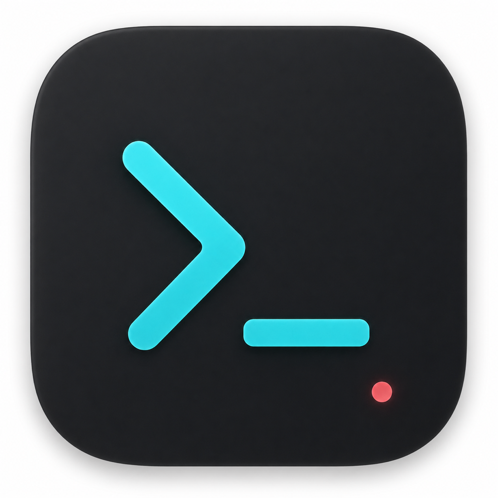
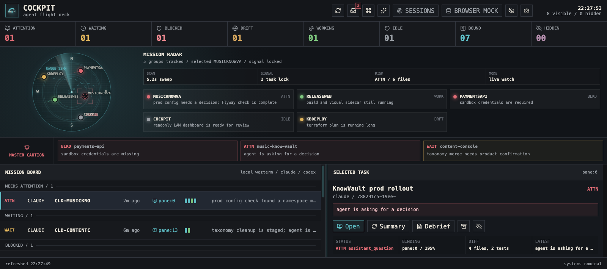

<p align="center">
  
</p>

<h1 align="center">Cockpit</h1>

<p align="center">
  A local flight deck for Claude Code and Codex CLI sessions.
</p>

<p align="center">
  <a href="#download">Download</a>
  ·
  <a href="#about">About</a>
  ·
  <a href="#workflow">Workflow</a>
  ·
  <a href="#development">Development</a>
</p>



## About

Cockpit is a desktop app for supervising terminal-based coding agents after the task has been handed off.

Claude Code and Codex stay in the terminal. Cockpit observes the local artifacts those sessions already produce: session logs, WezTerm panes, process state, and git working trees. Instead of showing another transcript, it turns that activity into an operating picture.

At a glance, Cockpit should make it clear:

- which agents need attention;
- which runs are working, idle, blocked, drifted, or done;
- what changed in the working tree;
- what tools, subagents, and replies led to the current state;
- which pane to open when human input is needed.

Cockpit is not a chat client and does not proxy agent traffic. The original terminal session remains the source of truth.

## Download

macOS builds are published on the Releases page.

Go to the [Releases](https://github.com/hsiaosiyuan0/cockpit/releases) page and download the latest `cockpit-*-darwin-arm64.zip`. The zip contains `cockpit.app`.

## What It Shows

- Mission Board for recent Claude Code and Codex sessions.
- Automatic WezTerm binding using pid, tty, cwd, and process evidence.
- Status categories for attention, blocked, drift, working, idle, and done.
- Mission Radar, Master Caution, Diff Radar, Trace, Flight Recorder, and Status Logic views.
- Done Inbox for completed tasks that still need review.
- One-click summaries and debriefs through isolated headless Codex runs.
- Command palette for search, open, bind, hide, summary, and debrief actions.
- Readonly LAN dashboard for watching from another device.

V1 is built around WezTerm because it exposes the pane metadata Cockpit needs. The terminal layer is meant to grow: Ghostty, iTerm2, and other terminal emulators are on the list once their pane/process APIs are wired in.

## Workflow

1. Start Claude Code or Codex in WezTerm.
2. Discuss the task and confirm what the agent should do.
3. Leave the terminal alone.
4. Watch Cockpit for status, trace, diff, and attention signals.
5. When something needs input, open the original pane from Cockpit.
6. Review completed work from the Done Inbox or Debrief panel.

## LAN View

The desktop app can start a readonly web dashboard for the local network.

The shared page can read dashboard state, traces, diff radar, flight recorder, settings, and Done Inbox data. It cannot open panes, bind sessions, archive items, edit settings, or start summary/debrief runs.

## Development

Requirements:

- Go
- Node.js and npm
- Wails v2
- WezTerm for pane binding and focus
- Claude Code CLI and/or Codex CLI for live sessions

Run the desktop app:

```sh
wails dev
```

Build a packaged app:

```sh
wails build
open build/bin/cockpit.app
```

If `wails` is not on your `PATH`, use the local Wails binary you installed. In my environment that is usually:

```sh
/tmp/cockpit-bin/wails build
```

Work on the frontend:

```sh
cd frontend
npm install
npm run dev
```

Opened outside Wails, the frontend uses mock data. Inside the desktop app, it talks to the Go backend through Wails bindings.

Run checks:

```sh
go test ./...
cd frontend && npm run build
wails build
```

## CLI

The CLI is for inspection and maintenance:

```sh
go run ./cmd/cockpit inspect
go run ./cmd/cockpit inspect --json
go run ./cmd/cockpit doctor
go run ./cmd/cockpit summarize <task-or-session-prefix>
```

Manual pane binding is available when automatic binding gets it wrong:

```sh
cockpit attach <task-or-session-prefix>
cockpit attach --detach <task-or-session-prefix>
```

## Data

Cockpit stores settings under `~/.local/state/cockpit` by default. Summaries and debriefs run through isolated headless Codex processes. Cockpit marks those internal runs and filters them out of the dashboard, so its own analysis does not show up as user work.
